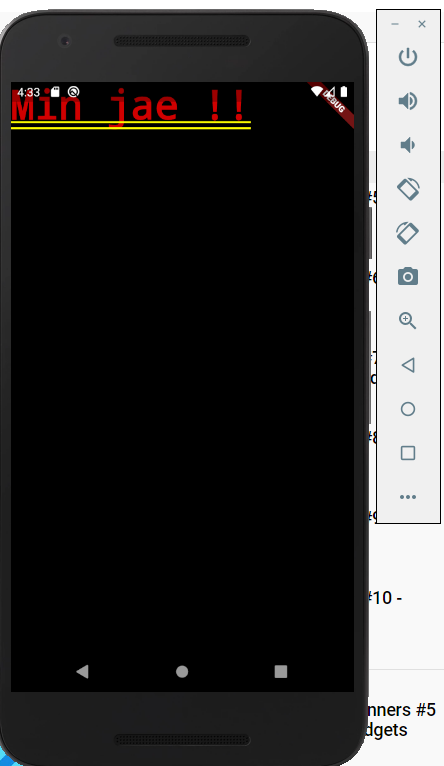
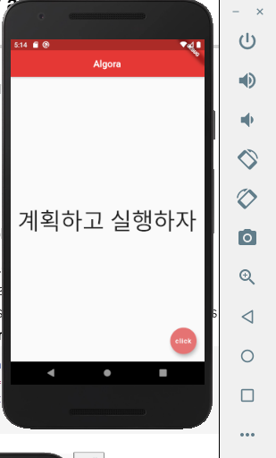
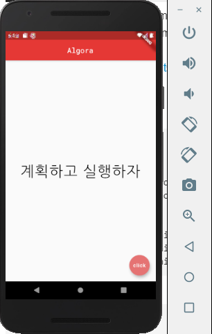
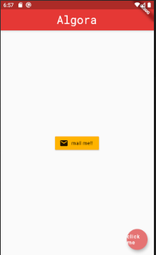
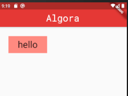
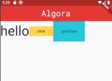
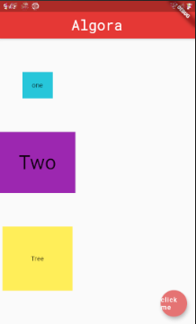
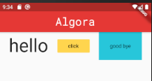

### Learn Flutter and Dart
- - - 
#### 5/31 Setting Flutter and Dart-sdk
   
##### A. Prime dart
1. data types
2. funtion
3. class
   
##### B. studied flutter folder structure and main.dart
1. decription **main.dart**
   MyApp class is all about apt and   
   and MyApp Class has many widgets ans elements
2. delete all src in **main.dart**
   ```dart
    import 'package:flutter/material.dart';
    void main() => runApp(MaterialApp(
      home:  Text('hey ninjas!'),
    ));
   ```
   
3. Scaffold & AppBarWidgets
   
   ```dart
   void main() => runApp(MaterialApp(
      home:  Scaffold(
        appBar: AppBar(
          title: Text('my yellow app'),
          centerTitle: true,
        ),
        body: Center(
          child: Text('hello minjae !'),
        ),
        floatingActionButton: FloatingActionButton(
          child: Text('click'),
        ),
      ),
    ));
   ```
   Scaffold class showing drawers, snack bars, and bottom sheets.
   and has properties like appBar,body,floatingActionButton
##### C. Colors & Fonts

1. Color setting
   ```dart
    import 'package:flutter/material.dart';
    void main() => runApp(MaterialApp(
      home:  Scaffold(
        appBar: AppBar(
          title: Text('Algora'),
          centerTitle: true,
          backgroundColor: Colors.red[600],
        ),
        body: Center(
          child: Text('계획하고 실행하자',
          textAlign: TextAlign.left,
          style: TextStyle(fontSize: 50),),
        ),
        floatingActionButton: FloatingActionButton(
          onPressed: () {},
          child: Text('click'),
          backgroundColor: Colors.red[300],
        ),
      ),
    ));
   ```
      

   Wigets or properties has Color memer or method
   we can choose default color or import Color Settings

2. Add external font
   1) Download from [Google Fonts]
   2) mkdir **'fonts'** in project dir
   3) add *.ttf
   4) change ./pubspec.yaml
   ```yaml
    fonts:
    - family: RobotoMono
      fonts:
        - asset: fonts/RobotoMono-Regular.ttf
        - asset: fonts/RobotoMono-Bold.ttf
    - family: NanumGothic
      fonts:
        - asset: fonts/NanumGothic-Regular.ttf
        - asset: fonts/NanumGothic-Bold.ttf
        - asset: fonts/NanumGothic-ExtraBold.tt
   ```
   5) add font fontFamily
   ```dart
    appBar: AppBar(
        title: Text(
          'Algora',
          style: TextStyle(
            fontFamily: 'RobotoMono'
          ),
        ),
        centerTitle: true,
        backgroundColor: Colors.red[600],
      ),
    ```
     

##### D. Stateless Widget

1. Stateless vs Stateful
    * stateless Widgets
    the state of the widget cannot change over time
    * stateful Widgets
    the state of the widget can change over time

2. Widget disjoin from main
   ```dart
    void main() => runApp(MaterialApp(
      home: Home()
    ));
    class Home extends StatelessWidget {
      @override
      Widget build(BuildContext context) {
          return Scaffold(
          appBar: AppBar(
            title: Text(
              'Algora',
              style: TextStyle(
                fontFamily: 'RobotoMono',
                fontSize: 30
              ),
            ),
            centerTitle: true,
            backgroundColor: Colors.red[600],
          ),
          body: Center(
            child: Text('계획하고 실행하자',
            textAlign: TextAlign.left,
            style: TextStyle(
              fontFamily: 'NanumGothic',
              fontSize: 40.0,
              fontWeight: FontWeight.w500,
              letterSpacing: 2.0,
              color: Colors.black
            ),),
          ),
          floatingActionButton: FloatingActionButton(
            onPressed: () {},
            child: Text('click me'),
            backgroundColor: Colors.red[300],
          ),
        );
      }
    }
   ``` 

##### E. Images & Assets
* add image
    Scaffold > body > child > Image(image :  )
    NetworkImage
    ```dart
      body: Center(
        child: Image(
          image: NetworkImage('url'),
        ),
      ),
    ```
    AssetImage
    ```dart
      body: Center(
        child: Image(
          image: AssetImage('assets/03.png')
        ),
      ),
    ```
    add this code in pubspec.yaml
    ```yaml
      assets:
        - assets/
    ```
##### F. Buttons & Icons
* Icons
   ```dart
  child: Icon(
    Icons.airport_shuttle,
    color: Colors.lightBlue,
    size:50.0,
  ),
   ```
* Buttons
   ```dart
  body: Center(
    child: FlatButton(
      onPressed: () {
        print('you clicked me!!');
      },
      child: Text(
        'click me',
      ),
      color: Colors.lightBlue[300]
    ),
  ),
   ```
   

##### G. Layout
* Containner & Padding
   **Code**
   ```dart
      body: Container(
        padding: EdgeInsets.symmetric(horizontal: 30.0,vertical: 10.0),
        margin: EdgeInsets.all(30.0),
        color: Colors.redAccent[100],
        child : Text('hello',
        style: TextStyle(
          fontSize: 30.0,
          fontFamily: 'RobotMono',
        ),)
      ),
   ```
   
* Rows & Column
  - **Rows**
   ```dart
    body: Row(
      children: <Widget>[
        Text('hello',style: TextStyle(fontSize: 50.0),),
        FlatButton(
          onPressed: ()=>print("click me!!"),
          color: Colors.amber[300],
          child: Text('click'),
        ),
        Container(
          color: Colors.cyan[400],
          padding: EdgeInsets.all(30.0),
          child: Text('good bye'),
        )
      ],
    ),
   ```
   

   - **Column**

   ```dart
    body: Column(
      mainAxisAlignment: MainAxisAlignment.spaceEvenly,
      children: <Widget>[
        Container(
          padding: EdgeInsets.all(20.0),
          color: Colors.cyan[400],
          child : Text('one')
        ),
        Container(
          padding: EdgeInsets.all(40.0),
          color: Colors.purple[500],
          child : Text('Two',textScaleFactor: 3,)
        ),
        Container(
          padding: EdgeInsets.all(60.0),
          color: Colors.yellow[400],
          child : Text('Tree')
        )
      ],
    ),
   ```
    

   - **AxisAlignments**

   ```dart
    body: Row(
      mainAxisAlignment: MainAxisAlignment.spaceEvenly,
      crossAxisAlignment: CrossAxisAlignment.start,
      children: <Widget>[ 
        Text('hello',style: TextStyle(fontSize: 50.0),),
        FlatButton(
          onPressed: ()=>print("click me!!"),
          color: Colors.amber[300],
          child: Text('click'),
        ),
        Container(
          color: Colors.cyan[400],
          padding: EdgeInsets.all(30.0),
          child: Text('good bye'),
        )
      ],
    ),
   ```
   

- - -

[Google Fonts]:(https://fonts.google.com/?subset=korean)